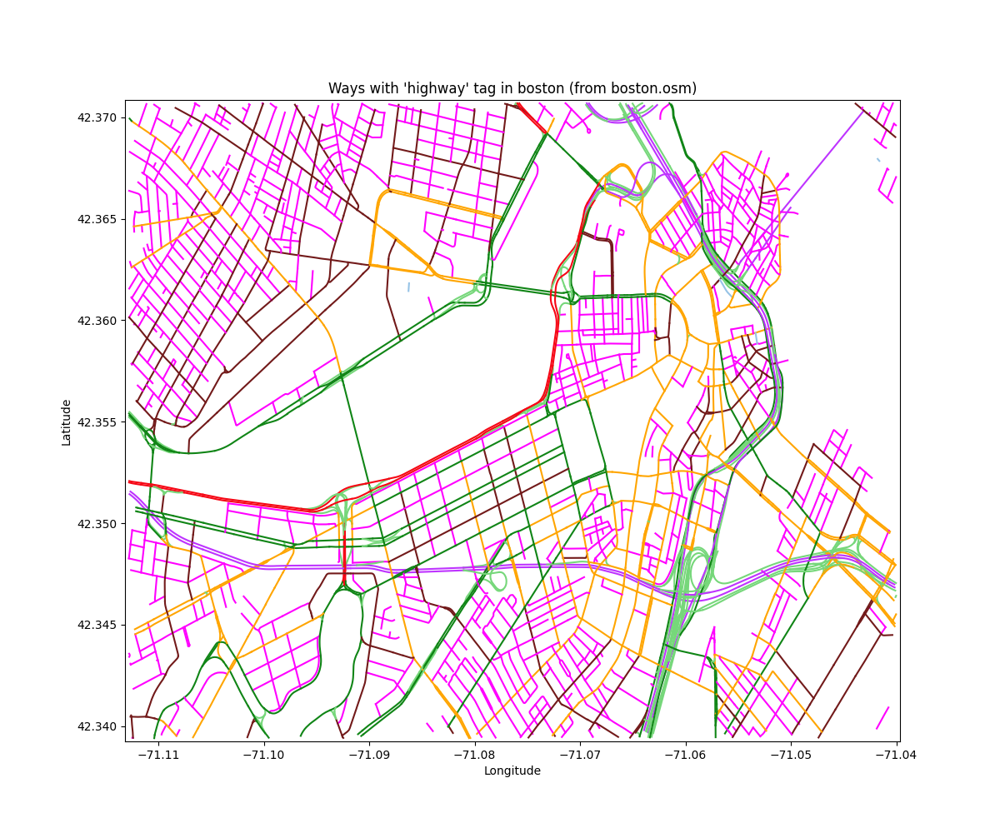

# Process for Extracting and Storing Information from `.osm` Files

I am extracting and reformating the data so that I can manipulate the information and generate a new format for 
creating "image-like" objects identifying where objects exist on a map. The new format will associate each node 
with ways and relations, then the combination of node ID, way ID, and relation ID can be used to identify if certain 
attributes apply to each node.

Parker Dunn (pgdunn@bu.edu)  
Dec 14, 2022

## References

**Information about the OSM Data**  
1. [OSM Map Features](https://wiki.openstreetmap.org/wiki/Map_Features) - A list of the features that might be 
  identified as tags.
  * "OpenStreetMap represents physical features on the ground (e.g., roads or buildings) using tags attached to its 
    basic data structures (its nodes, ways, and relations). Each tag describes a geographic attribte of the feature 
    being show by that specific node, way, or relation."

## To Do

- [ ] I extracted the nodes, but need to backtrack and make updates
    - [ ] Extract and store `tag` information (I did not extract any 'metadata' type information yet)
- [ ] Add labels to plots with ways extracted for a specific tag -> updates to `plot_ways_with_tag()`
- [ ] Create plot demonstrating how "ways" (and "nodes" ... not sure what useful objects contain ways and nodes) are 
  used to compose "relations"
- [ ] Create a method that aggregates the nodes and ways that make up relations into a DataFrame containing only 
  `node_id` (which may be extracted from a way) and `relation_id`
___
- [X] I am skipping extracting `tag`s from the `<way>` objects as well. There are many data points to extract. I'll 
  try to sort out what I need later.
  - `osmdata.extract_ways()` takes care of this task
- [X] Extract ways with a specific tag and plot them

- [X] Extract relation data
- [X] Extract relations with specific tags - e.g., the "building" tag

## Progress

### Extracting the `nodes` from `.osm` files

* I wrote a method for extracting all nodes in a provided OpenStreetMaps data file. -> `extract_nodes()`
  * The OUTPUT is a pandas.DataFrame containing one row for each node in the file.
* The `plot_nodes()` method can be used to visualize the nodes in a pandas DataFrame from using `extract_nodes()`

Here is an example of the output that you get...

There isn't much to take away from this image. Each node collected is plotted as a separate marker. Thus, dark blue 
areas represent a dense cluster of nodes.

I have not worked with the attributes attached to these nodes so far. It should be possible to save the attributes 
associated with these nodes, then reference the attributes to determine how they might be colored. A simple example, 
a node tagged with "traffic light" is blue, a node tagged with "road" is yellow, etc.

### Extracting the `way` objects from `.osm` files

* I wrote a method for extracting all "ways" from an OSM data file: `extract_ways()`
  * The method does the following...
  
  > This method loads a ".osm" file provided as an input and extracts information 
  > about the "way" objects in the file. The contributing nodes are returned as a
  > DataFrame so that they can be merged with the node location data. The **way tags**
  > are also extracted and saved in a JSON file.

  * The output of this method is a pandas DataFrame with an entry for each unique combination of node ID and way ID
  * The output of this method is designed to be used in a join operation with `extract_nodes()`. The output of a 
    join operation is a DataFrame with all OSM nodes tagged with their associated ways.
  * **ADDITIONALLY**, this is designed to save the attributes associated with each way in a JSON file with the 
    format `way_*id_number*.json`
    * The attributes of each way can therefore be retrieved based on way ID alone whenever needed.

* I also wrote a method to plot each way: `plot_ways()`
  * The method finds each unique way ID and plots all nodes associated with the ID.

This image below demonstrates the type of higher-order geographic information that is available for each extracted 
way. Unfortunately, there is overlap in colors, so it is impossible to neatly identify all 10,000+ ways with color 
alone. However, the plots with fewer ways (e.g., 1000 ways) demonstrate the amount of information available from 
each extract way.

### Extracting ways with certain attributes

#### Attributes of interest (from ref 1)

* Buildings
  * "building:part" - e.g., `{ "building:part" : "yes" }`
* Roads
  * "highway" - e.g., `"highway": "residential"`
  * "lanes" - e.g., `"lanes" : "1"`
  * "name" - e.g., `"name" : "Bent Street"`
  * "oneway" - e.g., `"oneway": "yes"`
  * "maxspeed" - e.g., `"maxspeed" : "25 mph"`
* Walkways

#### Extract and plot all roads

* Step 1: Modify `extract_ways` to create a new variation of the method that assesses if a way has a certain "map 
  feature"/tag and only returns the way if it contains the tag
* Step 2: Use the new method from step 1 to extract all possible roads!
  * I will start by trying to extract only ways with the "highway" tag.
  * Any way containing this tag and any of the following values will be extracted...
  * motorway
  * trunk
  * primary
  * secondary
  * tertiary
  * residential
  * motorway_link
  * trunk_link
  * primary_link
  * secondary_link
  * tertiary_link
  * living_street
* Step 3: Plot the roads using a similar plotting method to the original
  * Modified the color scheme to be specific to the values above

### Extracting 'relations' from OSM data

The structure of the OSM data with regard to ways and relations seems to be quite similar. Each has a collection of 
tag and node children associated with them. I'm not sure if the nodes in the relation data are different from the 
ways. The tags associated with the relations seem to be quite similar to the ways.

The first thing I did was list out the tags associated all relations in the `boston.osm` data. The tags (not their 
values) are saved in the `boston_relation_tags.txt` file. There is a sample of tags that seemed particularly 
important below.

* Highways/roads
  * restriction
* Pathways
  * railway
* Buildings
  * building:levels
  * building:flats
  * building:use
  * building:part
* Tags that I'm curious about...
  * access
  * place

In large part, the tags describe names or features of buildings/places. The attributes seem much less vital to 
gathering useful information about the road compared to the nodes and ways.

Relations can contain nodes and/or ways. I have written `extract_relations()` to pull all relations out of an OSM 
data file. This function extracts all relations from a file and returns a DataFrame with a row for each way or node 
in the relation. Each row has a real ID value for the data object it represents - i.e., there is a real node ID if 
the row represents a node within the relation and a real way ID if the row represents a way within the relation, and 
a "0" for the object that is not represented by the row. **While it might be helpful in some cases to extract all 
objects corresponding with a relation, it does not seem that this extraction format is particularly effective.**

I think it will be far more useful to use relations to identify collections of ways that go together.

### Plotting the relations that contain buildings

* I wrote a method that finds all relations with a specified attribute: `extract_relations_with_tag()`
  * Generally, this method operates the same way as `extract_relations()`
  * I noticed when I look for relations containing the tag "building" that the extracted relations contain only ways,
    which is kind of what I expected/hoped. *It suggests to me that the primary purpose of relations is the creation 
    of higher-order structures from ways.*

*To be continued...*
