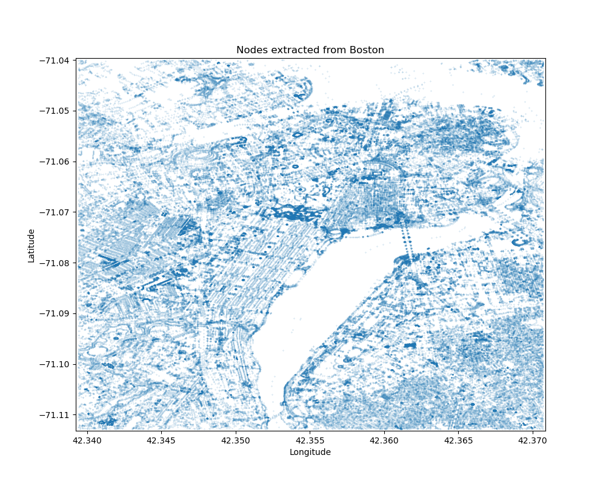
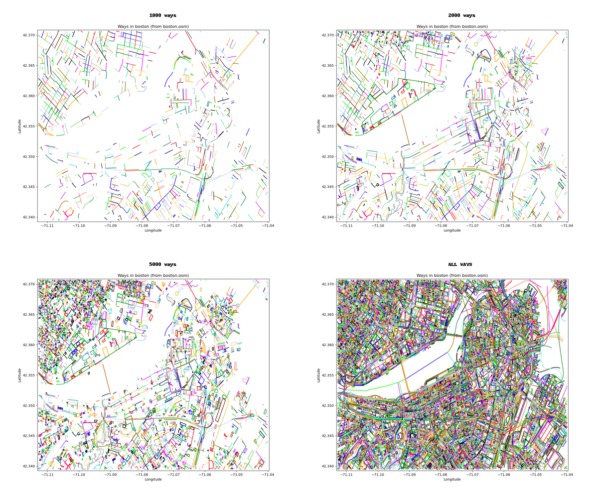

# Process for Extracting and Storing Information from `.osm` Files

I am extracting and reformating the data so that I can manipulate the information and generate a new format for 
creating "image-like" objects identifying where objects exist on a map. The new format will associate each node 
with ways and relations, then the combination of node ID, way ID, and relation ID can be used to identify if certain 
attributes apply to each node.

Parker Dunn (pgdunn@bu.edu)  
Dec 14, 2022

## References

## To Do

- [ ] I extracted the nodes, but need to backtrack and make updates
    - [ ] Extract and store `tag` information (I did not extract any 'metadata' type information yet)

- [X] I am skipping extracting `tag`s from the `<way>` objects as well. There are many data points to extract. I'll 
  try to sort out what I need later.
  - `osmdata.extractways()` takes care of this task

## Progress

### Extracting the `nodes` from `.osm` files

* I wrote a method for extracting all nodes in a provided OpenStreetMaps data file. -> `extract_nodes()`
  * The OUTPUT is a pandas.DataFrame containing one row for each node in the file.
* The `plot_nodes()` method can be used to visualize the nodes in a pandas DataFrame from using `extract_nodes()`

Here is an example of the output that you get...

There isn't much to take away from this image. Each node collected is plotted as a separate marker. Thus, dark blue 
areas represent a dense cluster of nodes.

I have not worked with the attributes attached to these nodes so far. It should be possible to save the attributes 
associated with these nodes, then reference the attributes to determine how they might be colored. A simple example, 
a node tagged with "traffic light" is blue, a node tagged with "road" is yellow, etc.

### Extracting the `way` objects from `.osm` files

* I wrote a method for extracting all "ways" from an OSM data file: `extract_ways()`
  * The method does the following...
  
  > This method loads a ".osm" file provided as an input and extracts information 
  > about the "way" objects in the file. The contributing nodes are returned as a
  > DataFrame so that they can be merged with the node location data. The **way tags**
  > are also extracted and saved in a JSON file.

  * The output of this method is a pandas DataFrame with an entry for each unique combination of node ID and way ID
  * The output of this method is designed to be used in a join operation with `extract_nodes()`. The output of a 
    join operation is a DataFrame with all OSM nodes tagged with their associated ways.
  * **ADDITIONALLY**, this is designed to save the attributes associated with each way in a JSON file with the 
    format `way_*id_number*.json`
    * The attributes of each way can therefore be retrieved based on way ID alone whenever needed.

* I also wrote a method to plot each way: `plot_ways()`
  * The method finds each unique way ID and plots all nodes associated with the ID.

This image below demonstrates the type of higher-order geographic information that is available for each extracted 
way. Unfortunately, there is overlap in colors, so it is impossible to neatly identify all 10,000+ ways with color 
alone. However, the plots with fewer ways (e.g., 1000 ways) demonstrate the amount of information available from 
each extract way.

